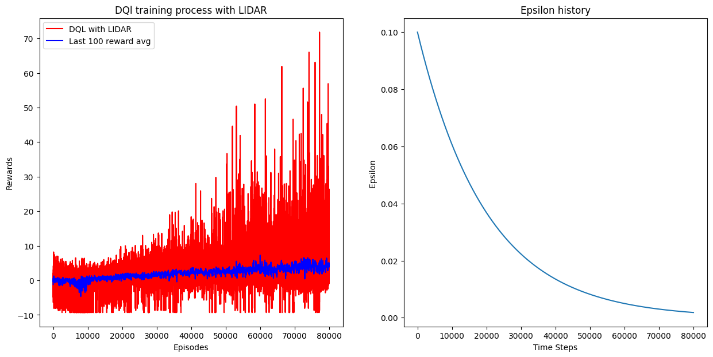
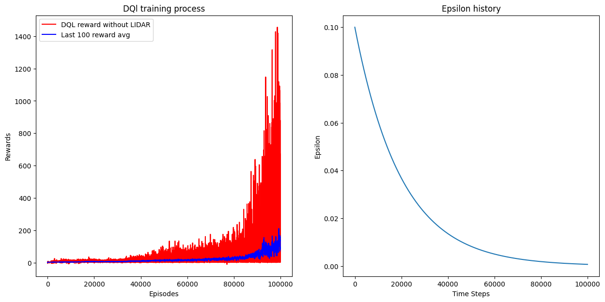

# Neuroevolution-vs.-DeepQ-Learning

This project compares two Reinforcement Learning (RL) approaches for solving the *Flappy Bird-v0* environment:
  1. Neuroevolution
  2. Deep Q-Learning

It includes detailed analysis, visualizations and pre-trained models.


## Table of contents

1. Key results
2. Project structure
3. Installation
4. Usage
5. Implemented methods
6. Hyperparameters
7. Visualizations
8. Conclusions


## Key results

|    Method                    |    5 episodes average reward    |    Training time    | 
|------------------------------|:-------------------------------:|:-------------------:|
|    Neuroevolution            |              75.3               |    ~3.5 hours       |
|    Neuroevolution + LIDAR    |              88.6               |    ~14.6 hours      |
|    Deep Q-Learning           |              12.9               |    ~4 hours         |
|    Deep Q-Learning + LIDAR   |              272.6              |    ~24 minutes      |

### Key findings:

  * DQL outperforms Neuroevolution in performance and training time without LIDAR.
  * Neuroevolution with LIDAR achieves better results but requires significantly more training time 
  * LIDAR does not always improve results since it increases the computational complexity


## Project structure

```text
├── DQL/                     
│   ├── dqlearning.py        
│   └── train_dql.py         
│
├── NE/                     
│   ├── neuroevolution.py   
│   └── train_neo.py         
│
├── utils/                  
│   ├── MLP.py              
│   └── test.py              
│
├── data/                    
├── results.ipynb
├── requirements.txt       
└── main.py
```


## Installation

1. Clone repository:
  ```text
  git clone https://github.com/tene04/Neuroevolution_vs_DeepQ-Learning.git
  cd Neuroevolution_vs_DeepQ-Learning
  ```
2. Install dependencies:
  ```text
  pip install -r requirements.txt
  ```


## Usage

All trained models are saved in the /data directory. To train custom models: 
  1. Modify the hyperparameters in main.py
  2. Run the script:
     ```text
     python main.py
     ```

To evaluate an agent:
  ```text
  from utils.test import eval
  
  env = gym.make("FlappyBird-v0", render_mode='human', use_lidar=True/False)
  reward = eval(best, env, model='DQL/neuroevolution', device='cuda')
  print(f"Average reward: {reward}")
  ```


## Implemented methods

### DQL

This method combines Q-learning with deep neural networks, it consist in:
  * Experience replay: stores a certain number of past transitions in a buffer. During training, random batches are samlped from this buffer to break temporal correlations and improve stability.
  * Target network: A separate neural network updated every x step which provides stable Q-value estimates during training, preventing harmful feedback loops.
  * Epsilon-greedy exploration: Set a probability to take a random action to explore the environmet, then exponentially decays exploration to focus on exploitation of learned knowledge.

### Neuroevolution

Is an evolutionary algorithm that optimizes neural networks through simulated evoulion, it has: 
  * Population-based: Maintains a number of different neural networks (individuals) that compete simultaneously.
  * Elite selection: Each generation, the top x individuals with highes performance survive, preserving successful traits.
  * Gaussian mutation: The survive individuals has a certain chance for any given weight to mutate. The mutation strenght is proportional to the weight´s magnitude plus a small noise. This helps to explore news solutions while maintaining useful features.

| Aspect         |    DQL                             |    Neuroevolution               |
|----------------|:----------------------------------:|:-------------------------------:|
| Learning       | Gradient descent on TD errors      | Evolutionary selection          |
| Parallelism    | Single agent                       | Population of x agents          |
| Exploration    | Controlled by ε-decay              | Emerges from mutations          |
| Best for       | Stable, predictable environments   | Environments with spare rewards |

### Implementation notes:
  * DQL leverages PyTorch´s automatic differentiation and CUDA support
  * Neuroevolution uses NumPy for efficient population operations
  * Training hardware was NVIDIA GPU for DQL and multi-core CPU for neuroevolution


## Hyperparameters

### DQL

* eps: Initial epsilon for epsilon-greedy exploration
* eps_decay: Factor by which epsilon decays
* eps_min: Minimun value for epsilon
* gamma: Discount factor for future rewards
* lr: Learning rate
* batch_size: Mini-batch size used in experience replay
* nsr: Number of steps before updating the target networks
* memory_max_len: Maximun size of the buffer

### Neuroevolution

* elite_fraction: Porcentage of best agents preserved for next generation
* pmut: Mutation probability
* N: Population size


## Visualizations

### Neuroevolution training progress


* Tracks maximun and average fitness across generations
* Shows evolutionary convergence patterns

### DQL training progress




* Display reward per episode and lass 100 rewards mean
* Includes epsilon-decay progress


### View results

To visualize model performance
1. Open the jupyter notebook (results.ipynb)
2. Run the following cells:
   * First cell: Load dependencies and helper functions
   * Second cell: Set gym environment and load best agents
   * Last cell: Render live gameplays of agents


## Conclusions

### Performance comparison

* DQL demostrates superior performance and faster convergence compared to Neuroevolution when no LIDAR sensor is used. This suggests that DQL is more sample-efficient and better suited for environments with limited sensory 
* Neuroevolution combined with LIDAR achieves better overall performance, particularly in complex environment where additional spatial information enhances the agent´s decision. However, this improvement comes at a hight computational cost, as training times increase significantly due to the large input space.

### LIDAR sensor analysis

The inclusion of LIDAR does not universally lead to improved results. While it provides richer environmental data, it also increases the dimensionality of the input, which can mamke learning slower and less stable, especially for methods that do not scale well with input complexity. In some cases, agents without LIDAR performed similar or even better, depending on the algorithm used and the task.Add commentMore actions

### Final veredict

While both methods can successfully solve Flappy Bird, DQL demostrates superior time efficiency and final performance withou LIDAR, making it better suited for this particular environment
